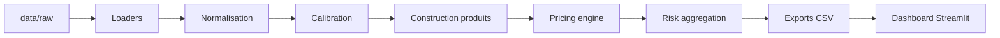
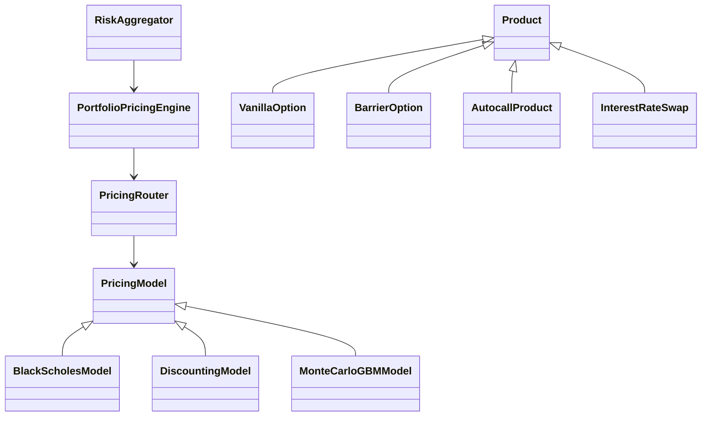

# Structured Products Pricer - Documentation projet

Ce projet implémente une application de pricing multi-produits pour des produits structurés et dérivés mono-sous-jacent. Il couvre la chaîne complète : ingestion des données, calibration des paramètres de marché, construction des produits, pricing, calcul de risques, agrégation portefeuille et visualisation Streamlit.

## Livrables

- Code Python : `src/`
- Données d'entrée : `data/raw/`
- Notebook final : `notebooks/`
- Exports dashboard : `reports/dashboard_exports/`
- Dashboard : `src/dashboard/`
- Documentation : `docs/`

## Lancement rapide

```bash
pip install -r requirements.txt
pip install streamlit plotly
streamlit run src/dashboard/app.py
```

Avant de lancer le dashboard, exécuter le notebook final pour générer les exports CSV dans `reports/dashboard_exports/`.

## Documentation incluse

- `docs/01_documentation_fonctionnelle.md`
- `docs/02_documentation_technique.md`
- `docs/03_modeles_formules.md`
- `docs/04_donnees_conventions.md`
- `docs/05_dashboard.md`
- `docs/06_validation_limites.md`
- `docs/architecture_mermaid.md`
- `RENDU_CHECKLIST.md`
# Documentation fonctionnelle

## Objectif

L'application permet de valoriser et d'analyser un portefeuille multi-produits composé de produits de taux, d'options, de stratégies optionnelles, d'options à barrière, de notes structurées et d'autocalls.

## Fonctionnalités

- Pricing ligne à ligne.
- Calcul des Greeks et métriques de risque.
- Agrégation par portefeuille, devise, classe produit, sous-jacent, maturité et bucket de strike.
- Stress tests de marché.
- Lecture d'un inventaire Excel.
- Génération de quatre portefeuilles de démonstration.
- Visualisation des résultats dans Streamlit.

## Parcours utilisateur

1. Placer `inventory.xlsx`, `options.csv` et `rate_curves.parquet` dans `data/raw/`.
2. Exécuter le notebook final.
3. Vérifier les exports dans `reports/dashboard_exports/`.
4. Lancer `streamlit run src/dashboard/app.py`.
5. Utiliser les filtres : portefeuille, devise, classe produit, sous-jacent.
6. Lire les onglets : vue d'ensemble, lignes de pricing, risques, stress tests, qualité et documentation.

## Interprétation financière

- `price` : valeur modèle dans la devise de risque.
- `delta` : sensibilité au sous-jacent.
- `gamma` : convexité au sous-jacent.
- `vega` : sensibilité à la volatilité.
- `theta` : sensibilité au temps.
- `rho` : sensibilité au taux.
- `dv01` : variation de valeur pour +1 bp de taux.

Les devises EUR et USD ne sont pas converties. Les totaux doivent donc être lus par `risk_currency`.
# Documentation technique

## Architecture

```text
src/
  calibration/     Calibration volatilité et validation marché
  conventions/     Calendriers, day count, business days
  dashboard/       Application Streamlit
  factory/         Builders produits et router modèles
  market/          Chargement et contexte de marché
  models/          Modèles de pricing
  portfolio/       Inventaire, portefeuilles, moteur de pricing
  products/        Définition objet des produits financiers
  rates/           Courbes de taux et bootstrapping
  risk/            Agrégation, Greeks numériques, stress tests
```

## Flux de données

```text
data/raw -> normalisation -> calibration -> pricing -> agrégation risque -> exports -> dashboard
```

## Modules principaux

### `src/config.py`

Centralise les chemins du projet : raw, interim, processed, notebooks, reports, dashboard exports.

### `src/portfolio/inventory_loader.py`

Lit l'inventaire Excel, normalise les noms de colonnes, convertit les dates/nombres/pourcentages, puis construit une vue prête pour le pricing.

### `src/portfolio/demo_portfolios.py`

Crée quatre portefeuilles de démonstration à partir de l'inventaire source.

### `src/factory/builders.py`

Transforme une ligne d'inventaire en objet produit.

### `src/factory/pricing_router.py`

Route automatiquement chaque produit vers le modèle adapté.

### `src/portfolio/pricing_engine.py`

Orchestre le pricing ligne à ligne.

### `src/risk/aggregator.py`

Agrège les métriques de risque par portefeuille, devise, produit, sous-jacent, maturité et strike.

### `src/risk/stress_testing.py`

Reprice le portefeuille sous différents scénarios de marché.

## Extensibilité

Pour ajouter un produit :

1. Créer une classe dans `src/products/`.
2. Ajouter un builder dans `src/factory/builders.py`.
3. Ajouter le routage dans `src/factory/pricing_router.py`.
4. Ajouter ou réutiliser un modèle dans `src/models/`.
5. Ajouter un test unitaire.
# Modèles, formules et métriques de risque

## Produits de taux

Zéro-coupon :

```text
PV = N * DF(0,T)
```

Obligation à coupons :

```text
PV = somme_i CF_i * DF(0,t_i)
```

Swap de taux :

```text
PV_swap = PV_fixed_leg - PV_floating_leg
```

## Options vanilles

Black-Scholes-Merton avec dividende continu :

```text
Call = S exp(-qT) N(d1) - K exp(-rT) N(d2)
Put  = K exp(-rT) N(-d2) - S exp(-qT) N(-d1)

d1 = [ln(S/K) + (r - q + 0.5 sigma^2)T] / [sigma sqrt(T)]
d2 = d1 - sigma sqrt(T)
```

## Stratégies optionnelles

Les stratégies sont valorisées par réplication statique :

```text
PV_strategy = somme_i quantity_i * PV(option_i)
```

## Options à barrière

Les options à barrière utilisent des formules fermées de type Reiner-Rubinstein/Merton pour des barrières simples sans rebate. Les knock-in peuvent être obtenus par parité :

```text
Vanilla = Knock-Out + Knock-In
```

## Autocalls

Les autocalls sont valorisés par Monte Carlo sous dynamique GBM risque-neutre :

```text
dS/S = (r - q) dt + sigma dW
```

## Volatilité implicite

Une surface de volatilité est construite par couple :

```text
(underlying, valuation_date)
```

Cela évite de mélanger les smiles de plusieurs sous-jacents.

## Convention DV01 / rho

```text
dv01 = V(r + 1bp) - V(r)
rho  ~= -dv01 / 1bp pour les produits de taux
```
# Données et conventions

## Fichiers d'entrée

```text
data/raw/inventory.xlsx
data/raw/options.csv
data/raw/rate_curves.parquet
```

## Inventaire

Le loader convertit les colonnes françaises vers un schéma anglais canonique :

- `date_valorisation` -> `valuation_date`
- `devise` -> `currency`
- `quantite` -> `quantity`
- `sous_jacent` -> `underlying`
- `maturite` -> `maturity_date`

## Données options

Le fichier `options.csv` sert à récupérer les spots, extraire ou reconstruire des volatilités implicites, construire des surfaces et valider le repricing. Le séparateur peut être `;`.

## Courbes de taux

`rate_curves.parquet` contient les points de courbe utilisés pour construire la courbe d'actualisation.

## Conventions de taille

Les prix dépendent fortement de :

- `quantity` : quantité issue de l'inventaire ;
- `notional` : nominal économique du produit ;
- `booking_notional` : taille harmonisée avant pricing ;
- `contract_multiplier` : multiplicateur de contrat.

Dans la version de rendu, lorsque `notional` est disponible, il est la taille économique de référence.

## Devises

Le projet distingue :

- `currency` : devise du produit ;
- `risk_currency` : devise de reporting risque.

Aucun total EUR+USD n'est calculé sans conversion FX.
# Documentation du dashboard Streamlit

## Lancement

```bash
streamlit run src/dashboard/app.py
```

## Exports attendus

Le dashboard lit `reports/dashboard_exports/` :

- `priced_lines.csv`
- `risk_by_product_class.csv`
- `risk_by_underlying.csv`
- `risk_by_maturity.csv`
- `risk_by_pillar.csv`
- `risk_safe_totals.csv`
- `stress_summary.csv`
- `stress_pnl_by_position.csv`
- `top_vega.csv`
- `economic_flags.csv`
- `quality_summary.csv`

## Utilisation

La barre latérale permet de filtrer : portefeuille, devise de risque, classe produit et sous-jacent.

Onglets :

- Vue d'ensemble : synthèse globale.
- Lignes de pricing : détail ligne à ligne.
- Risques agrégés : analyse par classe, sous-jacent, maturité, pilier.
- Stress tests : P&L par scénario.
- Qualité et limites : flags économiques et conventions.
- Documentation : rappels fonctionnels.

## Choix de conception

Le dashboard ne relance pas le pricing. Il lit les exports validés par le notebook afin de garantir une restitution stable.
# Validation, contrôles et limites

## Contrôles effectués

- Statut des lignes de pricing.
- Présence d'erreurs dans `error_message`.
- Cohérence entre lignes de pricing et agrégations.
- Contrôle des totaux par devise.
- Contrôle des stress tests.
- Identification des prix extrêmes.
- Identification des autocalls potentiellement exprimés en fraction du nominal.
- Analyse des top expositions vega.

## Problèmes identifiés et interprétation

### Prix optionnels élevés

Un prix optionnel élevé peut être dû à la taille de position. Ce n'est pas forcément un bug : il faut vérifier `quantity`, `notional` et `contract_multiplier`.

### Autocalls proches de 1

Un autocall autour de `0.86` indique souvent un prix exprimé en fraction du nominal. S'il doit être lu sur nominal 100, cela correspond à environ `86`.

### Vega négatif

Un vega négatif peut être normal pour des butterflies, options barrières ou positions optionnelles short.

### Multi-devise

Le portefeuille contient EUR et USD. Les totaux multi-devises ne sont pas additionnés sans FX.

## Limites de modélisation

- Produits mono-sous-jacent seulement.
- Pas de quanto.
- Autocalls simplifiés.
- Pas de corrélation multi-actifs.
- Surface de volatilité dépendante de la qualité du panel d'options.
- Stress tests simples, non historiques.
# Schémas d'architecture

## Flux global



## Architecture objet


