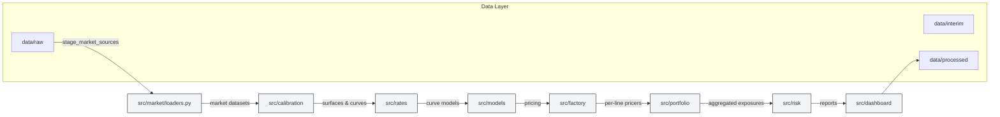

# Structured Products Pricer

## Objectif

Ce dépôt fournit une application Python modulaire pour le pricing de produits structurés mono-underlying, la calibration de surfaces de volatilité et de courbes de taux, la gestion d'inventaire et l'agrégation de risque.

---

**Résumé**: ce README décrit le projet, l'arborescence, la structure du code, les commandes d'installation et d'exécution, ainsi qu'un diagramme d'architecture Mermaid. Une version bilingue (FR / EN) est fournie.

**Table des matières**

- **Objectif**
- **Quick Start / Installation**
- **Arborescence & Fichiers clés**
- **Description des composants**
- **Exemples d'usage**
- **Tests**
- **Contribuer / Prochaines étapes**

**Quick Start / Installation**

FR — En local (conda recommandé) :

```bash
conda env create -f environment.yml
conda activate structured-products-pricer
pip install -r requirements.txt  # si présent
```

Windows PowerShell (venv) :

```powershell
python -m venv .venv
.\.venv\Scripts\Activate.ps1
pip install -r requirements.txt
```

Exécuter les tests :

```bash
pytest -q
```

EN — Quick start (conda):

```bash
conda env create -f environment.yml
conda activate structured-products-pricer
pip install -r requirements.txt
pytest -q
```

**Arborescence & Fichiers clés**

Racine (sélection) :

- [environment.yml](environment.yml)
- [README.md](README.md)
- [data/](data)
- [notebooks/](notebooks)
- [scripts/](scripts)
- [src/](src)
- [tests/](tests)

Sélection détaillée de `src/` :

- [src/config.py](src/config.py)
- [src/convention.py](src/convention.py)
- [src/io_utils.py](src/io_utils.py)
- [src/market/loaders.py](src/market/loaders.py)
- [src/market/market_context.py](src/market/market_context.py)
- [src/market/market_data.py](src/market/market_data.py)
- [src/calibration/base.py](src/calibration/base.py)
- [src/calibration/implied_vol.py](src/calibration/implied_vol.py)
- [src/calibration/svi.py](src/calibration/svi.py)
- [src/calibration/vol_surface_registry.py](src/calibration/vol_surface_registry.py)
- [src/rates/bootstrap.py](src/rates/bootstrap.py)
- [src/rates/yield_curve.py](src/rates/yield_curve.py)
- [src/models/black_scholes.py](src/models/black_scholes.py)
- [src/models/monte_carlo.py](src/models/monte_carlo.py)
- [src/products/structured_notes.py](src/products/structured_notes.py)
- [src/products/vanilla_option.py](src/products/vanilla_option.py)
- [src/factory/pricing_router.py](src/factory/pricing_router.py)
- [src/portfolio/pricing_engine.py](src/portfolio/pricing_engine.py)
- [src/portfolio/inventory_loader.py](src/portfolio/inventory_loader.py)
- [src/risk/aggregator.py](src/risk/aggregator.py)
- [src/dashboard/](src/dashboard)

Vérifiez ces fichiers si vous cherchez les implémentations principales ou l'entrée des données marché.

**Description des composants (détaillé)**

FR — Composants principaux :

- `src/market/` — Loaders et normaliseurs (voir [src/market/loaders.py](src/market/loaders.py)). S'occupe de la copie/staging depuis les sources externes vers `data/raw/`, et de la normalisation vers `data/interim/`.
- `src/calibration/` — Bootstrap de courbes et calibration de volatilité (SVI/SSVI). Modules: `base.py`, `implied_vol.py`, `svi.py`, `vol_surface_registry.py`.
- `src/rates/` — Instruments de marché et logique de courbe (`bootstrap.py`, `yield_curve.py`).
- `src/models/` — Implémentations de modèles (Black-Scholes, Monte Carlo, discounting).
- `src/products/` — Représentation des produits (vanilla, structured notes, swaps, autocalls). Voir notamment `vanilla_option.py`, `structured_notes.py`, `autocall.py`.
- `src/factory/` — Logique de routage et construction de pricers (`pricing_router.py`, `builders.py`).
- `src/portfolio/` — Ingestion d'inventaire et moteur de pricing (`inventory_loader.py`, `pricing_engine.py`, helpers dans `__init__.py`).
- `src/risk/` — Agrégation et grecs numériques (`aggregator.py`, `numerical_greeks.py`, `stress_testing.py`).
- `src/dashboard/` — Routines d'export pour rapports et tableaux de bord.
- Utilitaires transverses: `src/config.py`, `src/convention.py`, `src/io_utils.py`.

EN — Component responsibilities (brief):

- `src/market/` — data ingestion, staging and normalization (see [src/market/loaders.py](src/market/loaders.py)).
- `src/calibration/` — yield curve bootstrap and IV surface calibration (SVI/SSVI).
- `src/rates/` — market instruments and yield curve utilities.
- `src/models/` — pricing models and pricer interfaces.
- `src/products/` — product definitions and cashflow expansion.
- `src/factory/` — pricer selection and construction.
- `src/portfolio/` — portfolio ingestion, normalization and `PortfolioPricingEngine` orchestration.
- `src/risk/` — greeks, aggregation and stress testing.

**Diagramme d'architecture (Mermaid)**

Le diagramme ci‑dessous donne une vue d'ensemble du flux de données et des couches applicatives.



**Exemples d'usage**

FR — Charger les courbes de taux :

```python
from src.market.loaders import load_rate_curves
df = load_rate_curves()
print(df.head())
```

FR — Construire un inventaire et lancer le pricing (exemple minimal) :

```python
from src.portfolio import load_inventory_workbook, PortfolioPricingEngine
inventory = load_inventory_workbook('data/raw/inventory.xlsx')
engine = PortfolioPricingEngine()
results = engine.price(inventory)
```

EN — Run tests quickly:

```bash
pytest tests/test_vol_surface_registry.py::test_registry_smoke -q
```

**Tests et validation**

- La suite principale se trouve sous [tests/](tests). Exécutez `pytest -q` pour lancer l'ensemble.
- Les notebooks sous [notebooks/](notebooks) fournissent des validations manuelles et démonstrations end-to-end (ex: `notebook_presentation_application.ipynb`).


---


