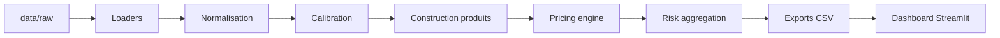
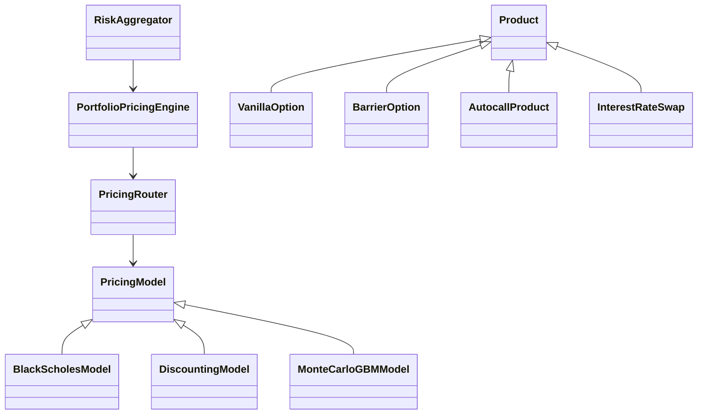

# Schémas d'architecture

## Flux global

```mermaid
flowchart LR
    A[data/raw] --> B[Loaders]
    B --> C[Normalisation]
    C --> D[Calibration]
    D --> E[Construction produits]
    E --> F[Pricing engine]
    F --> G[Risk aggregation]
    G --> H[Exports CSV]
    H --> I[Dashboard Streamlit]
```

## Architecture objet

```mermaid
classDiagram
    class Product
    class PricingModel
    class PortfolioPricingEngine
    class PricingRouter
    class RiskAggregator
    Product <|-- VanillaOption
    Product <|-- BarrierOption
    Product <|-- AutocallProduct
    Product <|-- InterestRateSwap
    PricingModel <|-- BlackScholesModel
    PricingModel <|-- DiscountingModel
    PricingModel <|-- MonteCarloGBMModel
    PortfolioPricingEngine --> PricingRouter
    PricingRouter --> PricingModel
    RiskAggregator --> PortfolioPricingEngine
```
